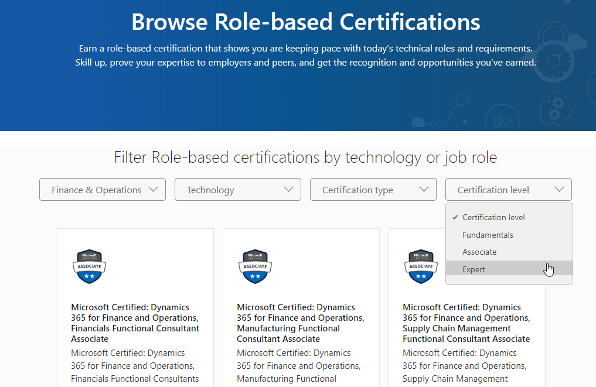
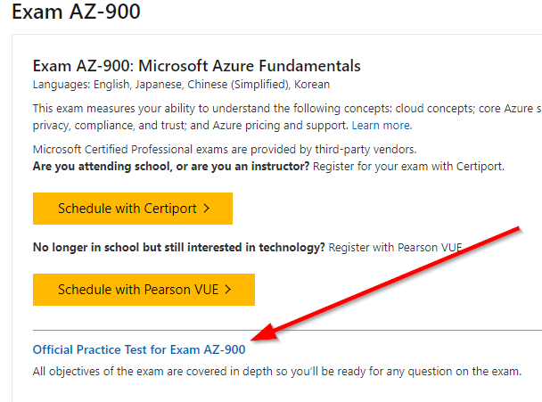

# Introduction
As in any other professional field, we know the value of self-improvement. It not only helps us face the competition, we also get to add value to our field of expertise. This is what inspired me to take the Microsoft certification exam. My journey is far from over as I still have at least two other exams to take. Anyway, this is my first post about my experience of the process and any tips I could share. Please note that as per the NDA we sign before taking the exam, I might not be able to give away a lot. This might be a good thing, so that, you get to experience a lot of it on your own.

## Why get a Microsoft Certification?
Goes without saying, Microsoft is already an established brand name in the field of Software Engineering. So being vouched by them for our skills is quite well received by peers, employers, recruiters and more. If my opinion doesn't actually sound convincing, Microsoft themselves provide a detailed page on [why get certified](https://www.microsoft.com/en-us/learning/certification-benefits.aspx).

## Finding the right certification
Microsoft have revamped their certification website to be [Microsoft Learning](https://www.microsoft.com/en-us/learning/default.aspx). It has lots of information including the one we saw earlier 'Why get certified?' and more. 
Simplest way to find what certification suits you is to [browse all certifications](https://www.microsoft.com/en-us/learning/browse-all-certifications.aspx). There you can filter on the basis of your needs.

Now that you know how to get to the list of available certifications, it is now up to you as to what to choose. Depending on what you are passionate about, or what your current/future role demands are, filter out and select your certification for further details.

# Microsoft Certified Azure Fundamentals
The [AZ-900 Microsoft Azure Fundamentals](https://www.microsoft.com/en-us/learning/azure-fundamentals.aspx#cert-expansion-tab-exam-az-900) exam is an important milestone to get into a Microsoft certification path with Microsoft Azure. This exam measures your ability to understand the following concepts: cloud concepts; core Azure services; security, privacy, compliance, and trust; and Azure pricing and support.

As it stands, the AZ-900 exam is optional exam if you aim at a certification such as [Microsoft Certified: Azure Administrator Associate](https://www.microsoft.com/en-us/learning/azure-administrator.aspx) or [Microsoft Certified: Azure Developer Associate](https://www.microsoft.com/en-us/learning/azure-developer.aspx). Nevertheless, it is quite the foundation stone upon which you can base your further learning. And if you have not taken any exams with Microsoft, starting with this one will give you more insight in the exam process itself if not just the technical knowledge around Azure fundamentals.

# Preparation
The following are the tips on how to prepare for the AZ-900 exam. Based on what I did. As I progess towards more difficult areas of exams, I might adapt these and will do future blog posts about them.

## Studying
The initial 'must do', in my opinion is to start with the self-paced interactive learning path as it would be recommended on the exam page. In case of AZ-900, it is the [Azure Fundamentals Learning Path](https://docs.microsoft.com/en-us/learn/paths/azure-fundamentals/). This is a [gamified](https://en.wikipedia.org/wiki/Gamification) learning path, which actually got me interested for a few days. And I learnt quite a bit, even though I started with a bias that it all might be easy. The fundamentals have some really exciting points which are a must know if you are aiming to be an expert in Azure. Take the concept of Azure Government for instance or why Azure Germany is unique non-government cloud or availability set vs availability zones. I actually had no idea about these. In case you do not too, do follow the learning path.

I did search for related topics on [Pluralsight](https://pluralsight.com) but given this is a fundamentals exam, I did't find any directly related learning paths on Pluralsight. Will continue checking for future exams and will add to posts then.

## Practice Exams
I used the practice exams recommended on the exam page.

I took lots of mock exams. The service provider [measureup](https://pts.measureup.com) provides a full history of the practice exams. The pass mark in practice exams is 80% and initially I scored 67%. But within a few days of those exams I started scoring around 80%. My aim was to score 100% consistently and then book the real exam. But I did lose patience and when I consistently started scoring 90%+ I booked the exam.

## Extras
### Listening
The overall idea of the certification exercise is continuous learning and getting vouched for it. So personally I think that should be the case in other parts of your professional activities as well. For example if you have got a colleague who knows more about Azure than you, it is definitely a good idea to get help, discuss ideas and listen to them. Listening is very important, followed by filtering and keeping what you believe is important for you.

### Local Events
I am lucky to be working at Oxford which means I get to attend events such as [.Net Oxford](https://www.dotnetoxford.com), [Azure Oxford](https://www.meetup.com/Azure-Oxford/) or [DevOps Oxford](https://www.meetup.com/devopsoxford/). These may not always be doing something directly related to AZ-900 or even Azure. But one of the techniques we all use consciously or subconsciously is  taking an educated guess while answering. This is where stimulating our brain comes in which in turn helps when we end up guessing applying certain method, process or logic which we can pick up from like minded people.

# Taking the exam
Having done all the preparation, taking the exam was actually less stressful that I has thought. As far as I know, there are two ways to take the exam.

## Exam Center
When you schedule the exam, I chose Pearson VUE, it leads you through a form to select an exam center and timing as per availability. Then on the scheduled time or normally 15mins before your exam, you reach the venue, go through an initial test exam and then take your exam.

I have also taken [Exam 483: Programming in C#](https://www.youracclaim.com/badges/e73e350b-d77e-402a-9575-6e37d4921e8f/public_url) in the past at the exam in Reading, Berkshire, UK. So this time around, I thought it would be good to try out the second option, BYOD.

## Proctored Exam: BYOD
BYOD (bring your own device) proctored exam is new to me and hence I chose this option for my AZ-900 exam.

The way it works is you take the exam on your chosen laptop and someone (or more people) will proctor the exam from a remote location. This means your machine will have to run a test provided by them before the exam starts and camera, microphone etc need to be working and switched on and your location is away from any kind of disruptions.

This is ok if you are taking the exam from an office meeting room where you are certain that nobody will knock or come in. I took the exam from my home office room, which was fine disruption wise, but it felt like letting a stranger(s) into my room. Next exam, I might take it from a office room or from exam center.

Having said so, I can totally see the benefit of BYOD for people who may not be able to go to the exam center. It needs further improvements, but I do congratulate MeasureUp on implementing it.

# Results
The exam results are generated immediate after the exam and it includes marks scored with a further breakdown of performance.

Having taken the exam, you can get details on your history, generate badges, certificates to share etc at [Microsoft Learning Dashboard](https://www.microsoft.com/en-us/learning/dashboard.aspx). Although this is present, I have struggled with the UI in the past and the Pearson VUE (the exam service provider) web site to get exam result details. Hence I always keep a pdf of the exam the moment it gets generated.

The badges are provided by [Acclaim](https://www.youracclaim.com/) for Microsoft. You can view and share the badges from acclaim's website.

# Conclusion
I managed to learn a lot more than Azure Fundamentals while taking the AZ-900 exam. Hoping this post helps others in preparation of a Microsoft exam. If you have any thoughts or comments please do get in touch with me on twitter [@rubberduckdev](https://twitter.com/rubberduckdev).