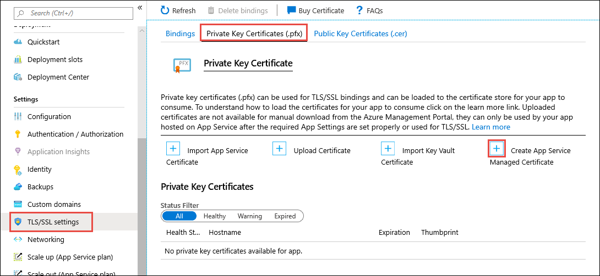

# Introduction
Took me a while on how to enforce https on the websites I have deployed using Azure App Service. The main blocker for me was getting a [SSL/TLS certificate](https://www.digicert.com/how-tls-ssl-certificates-work). Given I have mostly hobby websites, one of the options was to get a free one from [https://letsencrypt.org](https://letsencrypt.org). But it quickly became clear from their documentation that there is a learning curve! Then I found the easy way out, [Azure App Service free managed certificate](https://docs.microsoft.com/en-us/azure/app-service/configure-ssl-certificate?tabs=apex).

# Azure App Service managed certificate
The Microsoft documentation itself is already very good, I will try to add the quick steps I did. Once we got a custom domain validated, then on it is quite simple.

Overall there are two main steps, create the certificate and then bind your custom domain.

## Create App Service Managed Certificate

 

## Add binding to secure custom domain

 

# Conclusion
Although it has been nicely documented, took me a while to figure that these are the two main steps needed. Hence this post, hope it helps someone else get there a bit quicker. If you have any thoughts or comments please do get in touch with me on Twitter [@rubberduckdev](https://twitter.com/rubberduckdev). Or use the Disqus plugin below.