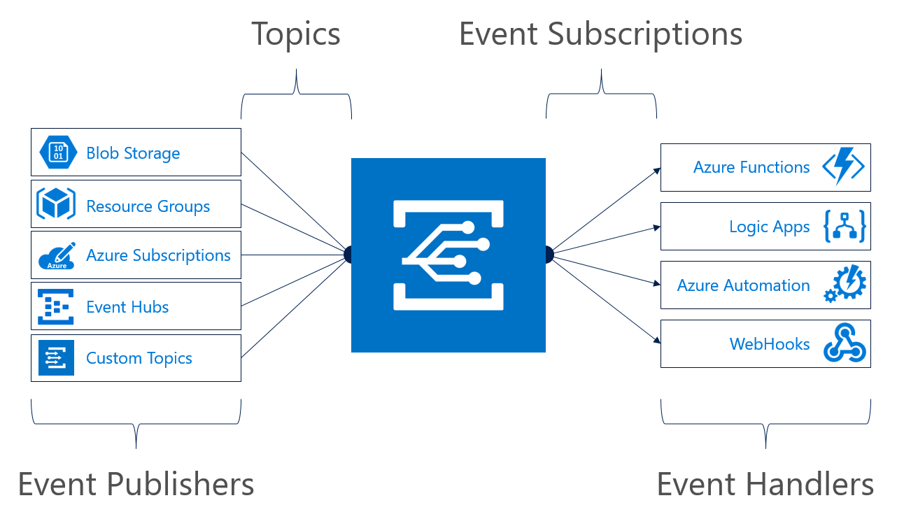

# Event grid
[Azure Event Grid](https://docs.microsoft.com/en-us/azure/event-grid/overview) is designed to build applications with event-based architectures. The events can be published from Azure or other sources and can be handled by services on Azure or elsewhere as long as they can subscribe to them. Event Grid has built-in support for events coming from Azure services, like storage blobs and resource groups. We can also design custom topics for our own events to be published onto the event grid.

# Event grid concepts
The key concepts of the event grid are in the diagram below.
<br/>

Essentially, picked straight from [documentation](https://docs.microsoft.com/en-us/azure/event-grid/overview#concepts).
There are five concepts in Azure Event Grid that let you get going:
* **Events** - What happened.
* **Event sources** - Where the event took place.
* **Topics** - The endpoint where publishers send events.
* **Event subscriptions** - The endpoint or built-in mechanism to route events, sometimes to more than one handler. Subscriptions are also used by handlers to intelligently filter incoming events.
* **Event handlers** - The app or service reacting to the event.

# Subscribing to Azure subscription topic
So in this post, we will focus on subscribing to events such as changes that happen to resources on Azure. This could be a file uploaded to blob storage, a new azure function created or something else. The main trick to getting the specific event we want is by using [filters](https://docs.microsoft.com/en-us/azure/event-grid/event-filtering).

## Azure portal
I would not write on this part, as lots of resources are available online including [documentation](https://docs.microsoft.com/en-us/azure/event-grid/event-filtering). Providing it here, for the sake of providing the easiest way to try and test.

## ARM Template
[ARM templates](https://azure.microsoft.com/en-gb/resources/templates/) provide a great means to implement [IaC](https://en.wikipedia.org/wiki/Infrastructure_as_code) and this is the main bit we will focus on in this post.

### Use case
Let's try to filter events in event grid to be triggered only when an Azure function changes in our subscription (say configuration change, code updated or new function created/deleted).

### Steps to put together the template
- Get the quick start template from [101-event-grid-resource-events-to-webhook](https://github.com/Azure/azure-quickstart-templates/blob/master/101-event-grid-resource-events-to-webhook/azuredeploy.json).
- Update filters in arm template
```
                "filter": {
                    "isSubjectCaseSensitive": false,
                    "subjectBeginsWith": "",
                    "subjectEndsWith": "",
                    "includedEventTypes": [
                        "Microsoft.Resources.ResourceWriteSuccess",
                        "Microsoft.Resources.ResourceDeleteSuccess"
                    ],
                    "advancedFilters": [
                        {
                            "values": [
                                "Microsoft.Web/sites/functions/write",
                                "Microsoft.Web/sites/functions/delete",
                                "Microsoft.Web/sites/hostruntime/vfs/run.csx/write",
                                "Microsoft.Web/sites/config/write"
                            ],
                            "operatorType": "StringIn",
                            "key": "data.operationName"
                        }
                    ]
                }
```

As far as I understand all values in `filter` section excluding `advancedFilters` are mandatory, at least how VSCode directed me. For the sake of our use case, we only need to look at `Microsoft.Resources.ResourceWriteSuccess` & `Microsoft.Resources.ResourceDeleteSuccess` events. The full list of event types for Azure subscription topic can be found at [Event Grid event schema](https://docs.microsoft.com/en-us/azure/event-grid/event-schema-subscriptions#available-event-types). Please note that the Azure subscription is our subscription on Azure and it is not implying subscribing the event grid.

After getting the right type of events, we would want to filter it down to specific changes in Azure functions. This can be done via `advancedFilters`. First of all, we need to look at an [example event from Azure subscription](https://docs.microsoft.com/en-us/azure/event-grid/event-schema-subscriptions#example-event).

```
[{
  "subject": "/subscriptions/{subscription-id}/resourcegroups/{resource-group}/providers/Microsoft.Storage/storageAccounts/{storage-name}",
  "eventType": "Microsoft.Resources.ResourceWriteSuccess",
  "eventTime": "2018-07-19T18:38:04.6117357Z",
  "id": "4db48cba-50a2-455a-93b4-de41a3b5b7f6",
  "data": {
    "authorization": {
      "scope": "/subscriptions/{subscription-id}/resourcegroups/{resource-group}/providers/Microsoft.Storage/storageAccounts/{storage-name}",
      "action": "Microsoft.Storage/storageAccounts/write",
      "evidence": {
        "role": "Subscription Admin"
      }
    },
    "claims": {
      "aud": "{audience-claim}",
      "iss": "{issuer-claim}",
      "iat": "{issued-at-claim}",
      "nbf": "{not-before-claim}",
      "exp": "{expiration-claim}",
      "_claim_names": "{\"groups\":\"src1\"}",
      "_claim_sources": "{\"src1\":{\"endpoint\":\"{URI}\"}}",
      "http://schemas.microsoft.com/claims/authnclassreference": "1",
      "aio": "{token}",
      "http://schemas.microsoft.com/claims/authnmethodsreferences": "rsa,mfa",
      "appid": "{ID}",
      "appidacr": "2",
      "http://schemas.microsoft.com/2012/01/devicecontext/claims/identifier": "{ID}",
      "e_exp": "{expiration}",
      "http://schemas.xmlsoap.org/ws/2005/05/identity/claims/surname": "{last-name}",
      "http://schemas.xmlsoap.org/ws/2005/05/identity/claims/givenname": "{first-name}",
      "ipaddr": "{IP-address}",
      "name": "{full-name}",
      "http://schemas.microsoft.com/identity/claims/objectidentifier": "{ID}",
      "onprem_sid": "{ID}",
      "puid": "{ID}",
      "http://schemas.microsoft.com/identity/claims/scope": "user_impersonation",
      "http://schemas.xmlsoap.org/ws/2005/05/identity/claims/nameidentifier": "{ID}",
      "http://schemas.microsoft.com/identity/claims/tenantid": "{ID}",
      "http://schemas.xmlsoap.org/ws/2005/05/identity/claims/name": "{user-name}",
      "http://schemas.xmlsoap.org/ws/2005/05/identity/claims/upn": "{user-name}",
      "uti": "{ID}",
      "ver": "1.0"
    },
    "correlationId": "{ID}",
    "resourceProvider": "Microsoft.Storage",
    "resourceUri": "/subscriptions/{subscription-id}/resourcegroups/{resource-group}/providers/Microsoft.Storage/storageAccounts/{storage-name}",
    "operationName": "Microsoft.Storage/storageAccounts/write",
    "status": "Succeeded",
    "subscriptionId": "{subscription-id}",
    "tenantId": "{tenant-id}"
  },
  "dataVersion": "2",
  "metadataVersion": "1",
  "topic": "/subscriptions/{subscription-id}"
}]
```

In the example event JSON, notice `operationName`. The full list of available operations can be found at [Azure resource providers operations](https://docs.microsoft.com/en-us/azure/role-based-access-control/resource-provider-operations). For our use case, we only need to look at specific operations from that list. And those values can be accessed via the `data` object as in our template.

```
                    "advancedFilters": [
                        {
                            "values": [
                                "Microsoft.Web/sites/functions/write",
                                "Microsoft.Web/sites/functions/delete",
                                "Microsoft.Web/sites/hostruntime/vfs/run.csx/write",
                                "Microsoft.Web/sites/config/write"
                            ],
                            "operatorType": "StringIn",
                            "key": "data.operationName"
                        }
                    ]
```
- Final ARM template should look like the one below:
```
{
    "$schema": "https://schema.management.azure.com/schemas/2019-04-01/deploymentTemplate.json#",
    "contentVersion": "1.0.0.0",
    "parameters": {
        "eventSubName": {
            "type": "string",
            "defaultValue": "subToResources",
            "metadata": {
                "description": "The name of the event subscription to create."
            }
        },
        "endpoint": {
            "type": "string",
            "metadata": {
                "description": "The URL for the WebHook to receive events. Create your own endpoint for events."
            }
        }
    },
    "resources": [
        {
            "type": "Microsoft.EventGrid/eventSubscriptions",
            "name": "[parameters('eventSubName')]",
            "apiVersion": "2018-01-01",
            "properties": {
                "destination": {
                    "endpointType": "WebHook",
                    "properties": {
                        "endpointUrl": "[parameters('endpoint')]"
                    }
                },
                "filter": {
                    "isSubjectCaseSensitive": false,
                    "subjectBeginsWith": "",
                    "subjectEndsWith": "",
                    "includedEventTypes": [
                        "Microsoft.Resources.ResourceWriteSuccess",
                        "Microsoft.Resources.ResourceDeleteSuccess"
                    ],
                    "advancedFilters": [
                        {
                            "values": [
                                "Microsoft.Web/sites/functions/write",
                                "Microsoft.Web/sites/functions/delete",
                                "Microsoft.Web/sites/hostruntime/vfs/run.csx/write",
                                "Microsoft.Web/sites/config/write"
                            ],
                            "operatorType": "StringIn",
                            "key": "data.operationName"
                        }
                    ]
                }
            }
        }
    ]
}
```
- Create an Azure function with [event grid trigger](https://docs.microsoft.com/en-us/azure/azure-functions/functions-bindings-event-grid-trigger?tabs=csharp). This function must exist before we deploy the arm template.
- Deploy arm template with `endpoint` parameter pointing to the function URL we created. Ensure they have the right keys or the handshaking will fail.

### Credits
I must mention these two gentlemen who helped me while I was trying to figure out how best to create the arm template. [Dan Clarke](https://twitter.com/dracan) for the initial tip to start investigating towards event grid for this use case and [Roman Kiss](https://stackoverflow.com/users/8084828/roman-kiss) for answering my question on [stackoverflow](https://stackoverflow.com/questions/62389029/event-grid-filter-events-to-all-azure-functions-in-subscription) and helping me out with the filters.

# Conclusion
It has been a satisfying learning experience figuring out the best means to trigger endpoints with events coming from resources. Event grid makes this very useful and easy. The possibilities are endless, we can have functions and services which act as per behaviour from resources. It makes automation of Azure resources easier too. Hope this post helps you in your efforts with event grid and arm templates. Do share thoughts and opinions on twitter or here.