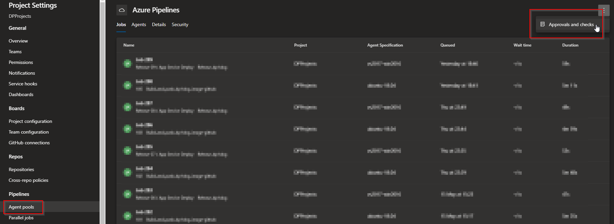
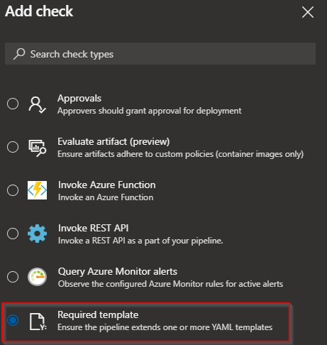

# Templates in Azure pipelines
Templates are a great way to achieve what we could do using [Task groups for builds and releases](https://docs.microsoft.com/en-us/azure/devops/pipelines/library/task-groups?view=azure-devops) in classic Azure DevOps pipelines. Using templates we can define reusable content, logic, and parameters.

# Template types
There are two types of templates, classified based on their usage.

## Type 1: Include/insert template
The include/insert type templates can be used to include content, similar to include directive in many programming languages. Or in the lines of XML include, where the content of one file can be inserted into another.

## Type 2: Extend template
The extends templates provide an outer structure of the pipeline and a set of places where the template consumer can make targeted alterations. Think in the lines of inheriting from an abstract class in C#. This kind of extends templates can be used to control what is allowed in a pipeline, the template defines logic that another file must follow.

# Enforcing policy - security & compliance
Using the extends templates, we can enforce policies on agent pools or environments.
## Usage
A simple usage can be as follows. The `start.yml` file below is the template which can be extended.

```
# File: start.yml
parameters:
- name: buildSteps # the name of the parameter is buildSteps
  type: stepList # data type is StepList
  default: [] # default value of buildSteps
stages:
- stage: secure_buildstage
  pool: Hosted VS2017
  jobs:
  - job: secure_buildjob
    steps:
    - script: echo This happens before code 
      displayName: 'Base: Pre-build'
    - script: echo Building
      displayName: 'Base: Build'

    - ${{ each step in parameters.buildSteps }}:
      - ${{ each pair in step }}:
          ${{ if ne(pair.value, 'CmdLine@2') }}:
            ${{ pair.key }}: ${{ pair.value }}
          ${{ if eq(pair.value, 'CmdLine@2') }}:
            '${{ pair.value }}': error

    - script: echo This happens after code
      displayName: 'Base: Signing'
```

This file takes in the build steps as a parameter and runs a `secure_buildstage`. As part of that stage, it is doing simple display statements here, but the idea is that it could be some very specific build steps it can perform, viz. build with code signing.

Some steps are generated using [template expressions](https://docs.microsoft.com/en-us/azure/devops/pipelines/process/expressions?view=azure-devops).
```
${{ if eq(pair.value, 'CmdLine@2') }}:
            '${{ pair.value }}': error
```
The above expression, for example, says if we try to add a (CmdLine@2 task)[https://docs.microsoft.com/en-us/azure/devops/pipelines/tasks/utility/command-line?view=azure-devops&tabs=yaml] then the pipeline will throw an error, essentially fail to build. This could be any other security or compliance requirement we might want to enforce on the pipeline.

The way to use the extends template is from a pipeline YAML file use extends key.
```
# File: azure-pipelines.yml
trigger:
- master

extends:
  template: start.yml
  parameters:
    buildSteps:  
      - bash: echo Test #Passes
        displayName: succeed
      - bash: echo "Test"
        displayName: succeed
      - task: CmdLine@2
        displayName: Test 3 - Will Fail
        inputs:
          script: echo "Script Test"
```

## Approval and checks

So until now, we have discussed how to enforce a policy after we have extended a template. The important bit is how to enforce that extension. This can be done in two places.

### Environment
In Azure pipelines [deployment environments](https://docs.microsoft.com/en-us/azure/devops/pipelines/process/environments?view=azure-devops) we can enable checks that any pipeline deploying to that environment must have extended a specific template.

</br>
### Agent pool
In Azure pipelines [agent pools](https://docs.microsoft.com/en-us/azure/devops/pipelines/agents/pools-queues?view=azure-devops&tabs=yaml%2Cbrowser) we can enable checks that any pipeline running on those agents will need to have extended a specific template.

</br>
</br>
On any of those two settings, environment or agent pool, we can enable template check.


# Issues, tips & tricks
Templates are really useful to enforce security and compliance requirements as described above. Although it does create a few issues. Luckily we seem to have solutions or at least workarounds for these.
## Complexity
Using templates can mean many seemingly unrelated files are related. The overall pipeline with logic, expressions and parameters can grow very quickly. That adds complexity to the system. The current solution provided by Microsoft are limits set on them. You can find [details of the limits in documentation](https://docs.microsoft.com/en-us/azure/devops/pipelines/process/templates?view=azure-devops#limits).
## Breaking changes
Along with complexity, there is the issue of introducing breaking changes in templates. If a template is used across pipelines and we want to introduce a breaking change, say for a new pipeline, it can still break the older ones. This can be avoided by using Git branch or tag. For example, keep the template in a separate repo as follows:
```
# template.yml
parameters:
- name: usersteps
  type: stepList
  default: []
steps:
- ${{ each step in parameters.usersteps }}
  - ${{ step }}
```

And use the template by specifying the `type`, `repository` & `ref`. This locks it down to a specific revision.
```
# azure-pipelines.yml
resources:
  repositories:
  - repository: templates
    type: git
    name: MyProject/MyTemplates
    ref: tags/v1

extends:
  template: template.yml@templates
  parameters:
    usersteps:
    - script: echo This is my first step
    - script: echo This is my second step
```

# Conclusion
As we have seen till now, templates are a great way of reusing pipeline code. As a bonus, they are now super useful for enforcing security and compliance practices on our software team. I hope this was useful, please do share any thoughts or comments you might have.