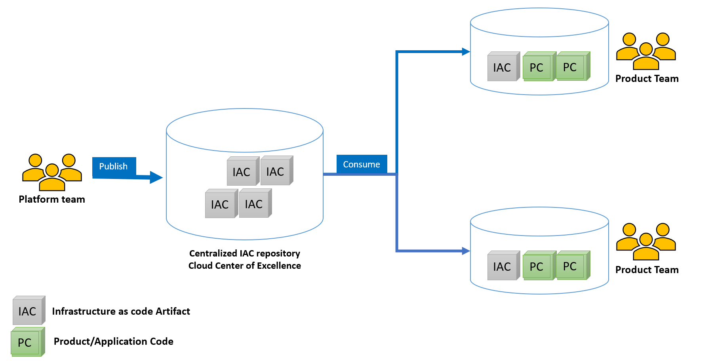

# Terraform modules

In Terraform world, modules are a way of reusing infrastructure configuration. We could create a module as a lightweight wrapper around a single resource or as a combination of multiple resources which need to be deployed regularly.

# The idea

I mostly specialize in Microsoft technologies and Azure cloud, so this post will circle these technologies. The team I work in currently own multiple Terraform modules and we are working towards adopting the model shown below.



<br/>

This image is from a [brilliant post](https://moimhossain.com/2020/11/27/azure-resource-governance-with-template-specs-biceps/) by [Moim Hossain](http://en.gravatar.com/mdmoimhossain).

The idea is, one team, the Platform team in this case (different organizations can have a similar team named differently say, Infrastructure team, DevOps team etc.) can design modules while liaising with security, management and other stakeholders. These modules should be designed generically, [tested](https://www.terraform.io/docs/extend/testing/unit-testing.html), [security analysed ](https://www.rubberduckdev.com/terraform-static-analysis/) and then shared for consumption across product/development teams.

Apart from true IaC and GitOps, the main advantages of this model are:

- **Ownership**: Resource deployment ownership lies with product teams. While the modules ownership lies with the Platform team.
- **Conventions and verifications**: We have verified configurations and conventions across the organization.
- **Control and sanity**: Platform team can maintain the overall sanity of infrastructure with controls in place such as [Azure policies](https://docs.microsoft.com/en-us/azure/governance/policy/overview).
- **Agility**: Product teams can drift away from modules under special circumstances. Or use other deployment technologies such as [Pulumi](https://www.pulumi.com/), [Bicep](https://github.com/Azure/bicep) or [PSArm](https://devblogs.microsoft.com/powershell/announcing-the-preview-of-psarm/) etc.

# Terraform module source

When consuming a module in Terraform we need to specify a source.

```
module "resource_group" {
  source = "./../modules/ResourceGroupModule"
  name     = "tfmoduletest3"
  location = "North Europe"
}
```

Notice the `source` parameter. Here it takes a local path to a terraform module. Terraform supports different [modules sources](https://www.terraform.io/docs/language/modules/sources.html). The one that we are interested in is [generic Git repository as a module source](https://www.terraform.io/docs/language/modules/sources.html#generic-git-repository).

## Creating and consuming Terraform modules

There is enough [documentation](https://www.terraform.io/docs/language/modules/develop/index.html) regarding the creation of Terraform modules and I am going to focus mostly on our approach towards consumption of modules across multiple teams.

See the examples on [Github](https://github.com/realrubberduckdev/tf-module-test). A very simple module can look like

```
variable "name" {
  type = string
}

variable "location" {
  type = string
}

variable "tags" {
  type = map
}

resource "azurerm_resource_group" "resource_group" {
  name     = var.name
  location = var.location
  tags = var.tags
}

output "name" {
  value = azurerm_resource_group.resource_group.name
}
```

And the way to consume it will be

```
provider "azurerm" {
    features {}
}

locals {
  tags = {
    "key1" = "value1"
  }
}

module "resource_group" {
  source = "git::https://github.com/realrubberduckdev/tf-module-test.git//modules//ResourceGroup?ref=9451c9a386b411b71400aa1a382c3e93b2b9e9a0"
  name     = "tfmoduletest3"
  location = "North Europe"
}

module "storage_account" {
  source = "git::https://github.com/realrubberduckdev/tf-module-test.git//modules//StorageAccount?ref=9451c9a386b411b71400aa1a382c3e93b2b9e9a0"
  name     = "dpteststrgacc1"
  resource_group_name = module.resource_group.name
  location = "North Europe"
}
```

Notice this in [main.tf](https://github.com/realrubberduckdev/tf-module-test/blob/main/ThisFolderCanBeInAnotherRepo/main.tf) on the GitHub repo. The git as module source lets us use a git repo we have access to while locking down to a specific commit hash. So product teams can use these modules in their repo while ensuring, they do not automatically pick up breaking changes.

## Possibilities

- **Semver**: The Platform team can use tools like [GitVersion](https://gitversion.net/docs/) to adopt [semantic versioning](https://semver.org/) and automate the module versioning using git tags. So there references do not need to be an unreadable hash, rather can be `ref=v1.0.0`.
- **Templates**: With proper cost implication investigations, the Platform team can group resources into being resource templates. Thus reducing overall cost for the organization.
- **Dotnet tool**: With a simple dotnet tool, we can adopt an organization-wide convention regarding [state file management](https://www.terraform.io/docs/language/state/index.html).

# Conclusion

This post is more about the concept and the workflow model and how Terraform helps us with the model adoption. Surely there will be other better technologies for [IaC](https://docs.microsoft.com/en-us/azure/devops/learn/what-is-infrastructure-as-code) and the quest to find a better one shall continue. Hopefully the one without state file management (more on this in a separate post). I hope this was useful, please do share any thoughts or comments you might have.
