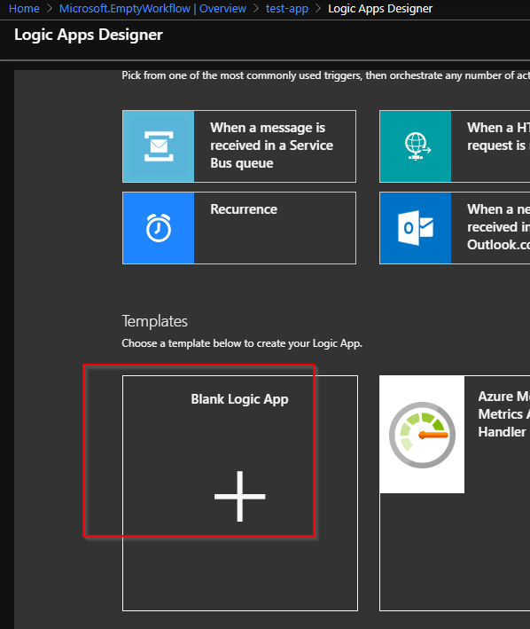
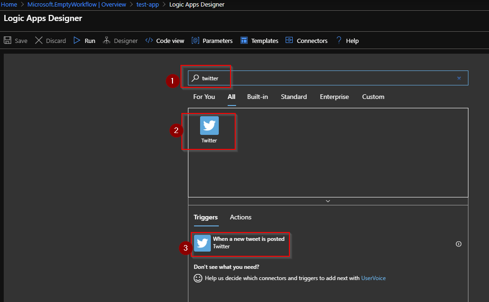
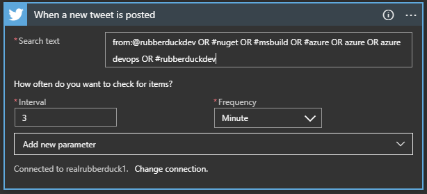
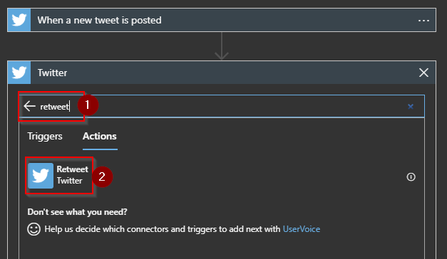
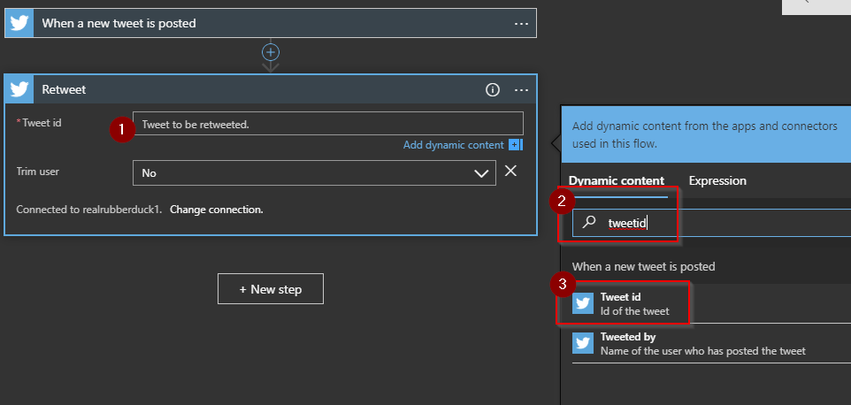

# Introduction
## Azure Logic Apps
[Azure Logic Apps](https://docs.microsoft.com/en-us/azure/logic-apps/) is a Microsoft cloud service that helps to schedule, automate, and orchestrate tasks, business processes, and workflows when we need to integrate apps, data, systems, and services across enterprises or organizations.
## Twitter bot
Twitter bots are possibly a thing of the past now, yet can be still useful. A twitter bot can automatically perform tweet/retweet/follow etc actions, either blindly or based on certain conditions. There are many ways to design one, using the host of [libraries provided by twitter](https://developer.twitter.com/en/docs/developer-utilities/twitter-libraries) or the Twitter API itself on [developer.twitter.com](https://developer.twitter.com/en).

# Twitter bot on Azure Logic Apps
## Requirements
Let's say we want a twitter bot that retweets every time I tweet something or if it meets the search criteria by containing keywords as follows:
```
#rubberduckdev
#nuget 
#msbuild 
#azure 
azure 
azure devops 
#rubberduckdev
```
## Development (drag & drop, few clicks or simple steps)
Development of logic apps is as simple as few clicks on the Azure portal. A programming background is useful to understand what is going on and troubleshoot if necessary. But it is not mandatory, well that is how Logic Apps have been marketed.

The steps to take are as follows:
* Setup a blank logic app. Follow [Microsoft documentation](https://docs.microsoft.com/en-us/azure/logic-apps/quickstart-create-first-logic-app-workflow) if unsure how it is done. 
___
* For logic app trigger, search for twitter and use `When a new tweet is posted`. 
___
* Enter values for `When a new tweet is posted` dialog box. Notice how `Search text` is set as a query. This is because it is a search query in the underlying logic app. So, to satisfy our requirements from subtopic above, it should be 
```
from:@rubberduckdev OR #nuget OR #msbuild OR #azure OR azure OR azure devops OR #rubberduckdev
```

___
* For logic app action following the trigger, search for twitter and use `Retweet`. 
___
* The `Retweet` action will need to know the tweet id to be retweeted and this will be obtained from the trigger. Search `Tweet id` in dynamic content and select it. 
___

That's it. Now save and your Twitter bot is ready. This bot will retweet any tweet by Twitter handle @rubberduckdev or any tweet that contains any of the keywords listed above. Although by design, this will only trigger once per hour (see limitations subtopic) and hence you may not see retweets straightaway. See the logic app run history for a detailed log.
 

## Limitations
The [Twitter logic app connector documentation page](https://docs.microsoft.com/en-us/connectors/twitter/) provides details on the limitations it comes with. One of the main limiting factors is `"Frequency of trigger polls: 1 hour"`, meaning the logic app will trigger only once an hour.

# Conclusion
The azure logic app is useful for a whole lot more than a simple twitter bot. But this is a simple example to get to understand how it works. It comes with a host of connectors, easy to use visual workflow and also many default templates to work with which are described in much detail in [Microsoft documentation](https://docs.microsoft.com/en-us/azure/logic-apps/logic-apps-overview#why-use-logic-apps).
Our twitter bot aims to do a simple task of retweeting and so the limitation we discussed above is not a major issue. Other connectors can come with their advantages as well as limitations, and we can also create a user voice if we want specific connectors.
With all this in mind, I hope this introduction to logic apps was useful and if you have any comments, thoughts or queries please do comment below or tweet me.

## Credits
Cover image from [cmarix](https://www.cmarix.com/wp-content/uploads/2019/10/Azure-Logic-Apps.jpg).