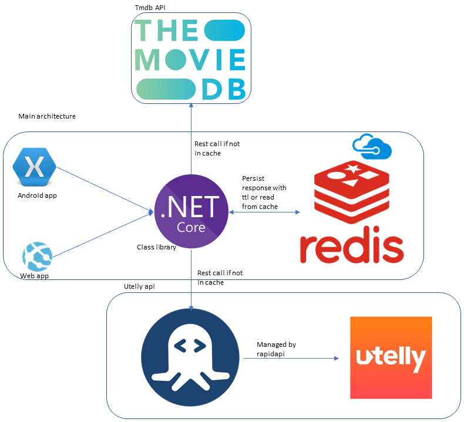

# Introduction
In recent holidays at the end of 2020, I thought of brushing up my dotnet core web development skills or to be honest learn about it. I have never been a professional web developer. My UI development skills still suck, but I learnt quite a bit about the whole architecture which is what I plan to share in this post. 

# The idea
The overall idea is to create an online service which can tell us where a certain tv show or movie is streaming. So, for example, we can search for [Tenet](https://www.imdb.com/title/tt6723592/) and it will find it for us where it is streaming, say Amazon prime for example.
I managed to deploy the [website](https://wherestreaming.tk/) with a free domain, thanks to [freenom](https://www.freenom.com/). Registration and binding of a custom domain with the azure app service can be a post by itself, maybe one for later.

# Architecture diagram
Planning to share the overall architecture of the project, which is as follows:

The main architecture bit is the one which is part of the project. There are two parts, the [website](https://wherestreaming.tk/) and an android app which is under development at the moment. Both of them depend on a dotnet core class library which handles all the logic. It calls into [Tmdb](https://www.themoviedb.org/) API and [UTelly](https://www.utelly.com/) API via [RapidAPI](https://rapidapi.com/marketplace). Tmdb is free and allows unlimited calls, so that is good for this project. But RapidApi only allows 1000 free calls a month.

To reduce operational costs, I used [Azure Cache for Redis](https://azure.microsoft.com/en-gb/services/cache). The call to Tmdb has a TTL of 1 day (to avoid redundant calls) and the Rapid API one has a TTL of 30 days. So we can do 1000 unique free calls, anything more than that will have a cost.

# CI CD
In my opinion, a good, reliable CI-CD is a must for robust software development. Azure DevOps (ADOS from here on) provides a very good suite of tools for this. I like GitHub actions, but as most of my private projects are currently on ADOS, it is easier for me to leverage that.

The whole continuous integration process of build, test and the following continuous deployment is automated. I am in the process of adding one manual approval step before the staging-production slot gets swapped.

# Conclusion
In conclusion, if you are curious about where your favourite show is streaming, do check it out at [https://wherestreaming.tk/](https://wherestreaming.tk/).

Overall doing this project during the holidays was both fun as well interesting. Learnt many tips and tricks which I will share in follow up posts. If you have any thoughts or comments please do get in touch with me on Twitter [@rubberduckdev](https://twitter.com/rubberduckdev). Or use the Disqus plugin below.